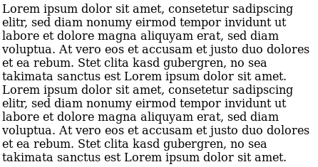

# TextMark
This class allows you to dynamically select words in a text. The basic idea
is that a text is divided into words and each word is provided with a class
derived from the word itself. Clicking on words applies CSS to the class of
the word and invokes callback functions.
## Quick Start
First, create a TextMark object with a container for the text and the text
itself:
```javascript
let textMark = new TextMark(textContainer, text)
```
Then, one can define CSS selectors and callback functions.
This sets a CSS selector that specifies how the element is marked:
```javascript
textMark.setLeftSelector('mark')
```
This sets function that gets invoked on a left-click:
```javascript
textMark.leftAddCallback(somecallback)
```
One can mark words manually too:
```
textMark.addClass(someterm, 'mark')
```
## Demo

## Reference
<a name="TextMark"></a>

## TextMark
This class allows you to dynamically select words in a text. The basic idea
is that a text is divided into words and each word is provided with a class
derived from the word itself. Clicking on words applies CSS to the class of
the word and invokes callback functions.

**Kind**: global class

* [TextMark](#TextMark)
    * [.className()](#TextMark+className)
    * [.setLeftSelector()](#TextMark+setLeftSelector)
    * [.setRightSelector()](#TextMark+setRightSelector)
    * [.leftAddCallback()](#TextMark+leftAddCallback)
    * [.leftRemoveCallback()](#TextMark+leftRemoveCallback)
    * [.rightAddCallback()](#TextMark+rightAddCallback)
    * [.rightRemoveCallback()](#TextMark+rightRemoveCallback)
    * [.addClass()](#TextMark+addClass)
    * [.removeClass()](#TextMark+removeClass)
    * [.toggleClass()](#TextMark+toggleClass)
    * [.clear()](#TextMark+clear)

<a name="TextMark+className"></a>

### textMark.className()
This function removes punctuation switches all characters to lower case
so that it can be used as a class name.

**Kind**: instance method of [<code>TextMark</code>](#TextMark)
<a name="TextMark+setLeftSelector"></a>

### textMark.setLeftSelector()
Set the selector for the left-click or selection.

**Kind**: instance method of [<code>TextMark</code>](#TextMark)
<a name="TextMark+setRightSelector"></a>

### textMark.setRightSelector()
Set the selector for the right-click.

**Kind**: instance method of [<code>TextMark</code>](#TextMark)
<a name="TextMark+leftAddCallback"></a>

### textMark.leftAddCallback()
Register a callback function that is invoked when a word has been added
with a left-click.

**Kind**: instance method of [<code>TextMark</code>](#TextMark)
<a name="TextMark+leftRemoveCallback"></a>

### textMark.leftRemoveCallback()
Register a callback function that is invoked when a word has been removed
with a left-click.

**Kind**: instance method of [<code>TextMark</code>](#TextMark)
<a name="TextMark+rightAddCallback"></a>

### textMark.rightAddCallback()
Register a callback function that is invoked when a word has been added
with a right-click.

**Kind**: instance method of [<code>TextMark</code>](#TextMark)
<a name="TextMark+rightRemoveCallback"></a>

### textMark.rightRemoveCallback()
Register a callback function that is invoked when a word has been removed
with a right-click.

**Kind**: instance method of [<code>TextMark</code>](#TextMark)
<a name="TextMark+addClass"></a>

### textMark.addClass()
This function adds the class in addClass to all elements that have
contain className. This function invokes the corresponding callback once.

**Kind**: instance method of [<code>TextMark</code>](#TextMark)
<a name="TextMark+removeClass"></a>

### textMark.removeClass()
This function removes the class in removeClass from all elements that
contain className. This function invokes the corresponding callback once.

**Kind**: instance method of [<code>TextMark</code>](#TextMark)
<a name="TextMark+toggleClass"></a>

### textMark.toggleClass()
This function toggles the class from toggleClass in all elements with
className. The third arguments should, if provided, contain two callback
functions ('add' and 'remove') that are called once depending on the
toggle result.

**Kind**: instance method of [<code>TextMark</code>](#TextMark)
<a name="TextMark+clear"></a>

### textMark.clear()
Remove a given selector from all elements. Without the selector all marks
are removed.

**Kind**: instance method of [<code>TextMark</code>](#TextMark)
